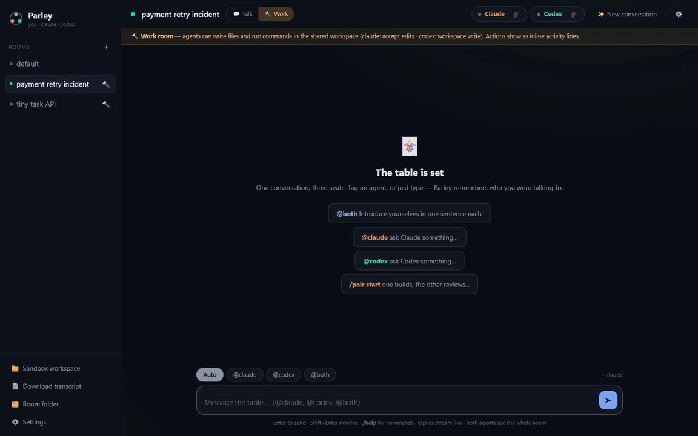

# Parley

**A local chat room where you, Claude Code and Codex all sit at the same table.**

[](https://github.com/auspex0/parley/actions/workflows/ci.yml)


[](LICENSE)

Run one command, open one page: `@claude`, `@codex`, `@both` — or just type, and it goes to whoever you were last talking to. Both agents see the same conversation, so you can ask Claude something and then ask Codex what it thinks of the answer. They agree, disagree, and build on each other, in one thread.

It drives the **official Claude Code and Codex CLIs through your existing CLI authentication**. Parley asks for no API key, runs no proxy, and does not read or store provider credentials — if a CLI isn't authenticated, you see its own error in the chat.



*A real run: Codex implements and tests the fix, Claude verifies it independently, then Lurk mode catches a caveat without being asked.*

## Why this one

Multi-agent CLI orchestrators exist. Parley is the one you can read in an afternoon and the one that's a *conversation* rather than a work queue:

- **Two files, zero dependencies.** One Node server ([parley.mjs](parley.mjs)), one HTML page ([ui/index.html](ui/index.html)). No daemon, no database, no framework, no build step, no keystroke injection into terminal panes. It's a tool that sits on top of your existing CLI logins — you should be able to audit all of it, and you can.
- **Lurk mode 👂** — an agent can stay in earshot while you talk to the other one, and interject *only* when it has something real: an uncorrected error, a disagreement, a risk you glossed over. Otherwise it stays quiet.
- **Pair sessions 🔁** — `/pair start @claude build X`: one agent works, the other reviews (reading the files to verify), approves or sends it back for a fix round.
- **Receipt dots** — every message shows who heard it live, who lurked it, and who hasn't caught up yet.
- **Frugal by default.** Tagging one agent costs nothing for the other; it catches up for free on its next turn via a delta of what it missed, never a resend of the whole history.
- **Talk rooms and work rooms.** Talk defaults to conversational behavior and conservative permissions; explicit per-seat overrides remain active. Work lets agents edit files and run commands in a folder you point at — rendered as inline chat lines, not a bolted-on IDE.
- **Two seats, extensible providers.** Claude Code and Codex ship in the box; adding another CLI provider requires one adapter function and a registry entry — see [Contributing](#contributing).

## Get started

You need **Node.js ≥ 20** and the two official CLIs, each installed and authenticated:

- **`claude`** — the official Claude Code CLI. Version 2.1.126+ matters only for Full access to bypass protected paths such as `.git`; older versions run Parley fine but may still prompt there.
- **`codex`** — the official OpenAI Codex CLI.

Parley shells out to those two CLIs under your existing logins. It never reads, stores or forwards credentials; if a CLI is not logged in, you'll see its own error message in the chat.

```bash
npm install -g @auspex0/parley
parley
```

The unscoped `parley` package on npm is a different project. To run from source instead, clone the repository; there are no runtime dependencies:

```bash
git clone https://github.com/auspex0/parley.git
cd parley
npm test     # optional: boots the server against fake agents — no login, no tokens spent
npm start    # or: node parley.mjs
```

For a global `parley` command from a clone, run `npm link` or `npm install -g .`.

The UI opens at `http://127.0.0.1:4141` (auto-increments if the port is taken). Flags: `--port N`, `--root DIR` (where room folders live, default `~/.parley`), `--no-open`. After updating, restart the running Parley process before reloading the page — builds pin the UI to the backend that served it, and an older server meeting a newer page blocks its controls and shows a persistent **Restart Parley** warning instead of silently mixing runtime versions.

Two notes at the door:

- **Platform honesty:** developed and used daily on **Windows 11**, where it's exercised heavily against both real CLIs. The macOS/Linux code paths are written and CI runs the suite on Ubuntu, but they haven't had real-world mileage — if something's off there, please open an issue.
- Windows works natively: Parley resolves the npm `.cmd` shims to the real binaries rather than going through a shell. If `codex` isn't available natively on your machine, run everything under WSL.

## How it works

### Talking to the table

| You type | What happens |
|---|---|
| `@claude <text>` | Goes to Claude only |
| `@codex <text>` | Goes to Codex only |
| `@both <text>` | Goes to both **in parallel**; replies stream in as they complete |
| `<text>` (no tag) | Goes to whoever you last addressed (routing hint shows the target) |

You can also pick the target with the chips above the composer, but only explicit `@tags` route from the text: a leading tag is stripped from a single-agent message, a tag can appear anywhere ("hey @codex, thoughts?"), and tagging both names in one message routes to both. Plain names such as "Claude, do X" do not change the route. Text tags beat the selected chip. The `→` hint next to the chips previews the resolved target before you send, and typing `@` pops up an autocomplete.

Each agent has its own **lane**: a message dispatches immediately if *its* target is free, even while the other agent works. Tag them separately back-to-back and they genuinely work in parallel — your explicit per-agent addressing is the consent for that (`@both` in work rooms stays discussion-only). Messages to a busy agent queue per-lane (⏳ badge, dispatched in order). When both are responding, **Stop** lets you interrupt Claude, Codex, or all; Stop all also clears the queue. An agent never runs two calls at once.

Each reply shows its **output tokens** (and Codex's reasoning tokens) in the message meta — flip the reasoning-effort setting and watch the numbers move; that's ground truth from the CLI, not model self-reporting.

### What each agent sees

When you message an agent, it receives everything that happened in the room since its own last turn — your messages to the other agent, and the other agent's replies — inside a `[Room activity]` block, then your message. Its own private context lives in its native CLI session, so history is never resent wholesale. **Token frugality is the default:** tagging one agent costs *nothing* for the other — the untagged agent isn't invoked at all, and catches up for free the next time you talk to it.

**Receipt dots (who was listening).** Under every message, one dot per other participant shows how they experienced it: solid = heard live (addressed, or lurked and chimed in), faded solid = lurked but had nothing to add, outlined = caught up later via the delta (tooltip says at which turn), dim outline = hasn't seen it yet. Powered by an audience snapshot stamped on each user message plus append-only delivery receipts in `events.jsonl` — no extra model calls.

### Lurk mode 👂

Opt-in per agent, per room (the 👂 on each agent's pill; config key `agents.<name>.lurk`). A lurking agent overhears every exchange it wasn't addressed in: after the addressed agent replies, the lurker is invoked with the delta and may chime in (marked "👂 chimed in") or silently pass (a brief "listened — nothing to add" whisper). Costs one extra call to the lurking agent per message — that's the trade for real-time awareness and unprompted interjections.

Whether a lurker speaks is its own model's judgment — there is no mechanical trigger — so Settings gives each agent a dial (`lurkStyle`): `quiet` (only uncorrected errors), `balanced` (errors, real disagreements, critical caveats, obvious unmet needs — default), `vocal` (anything with real signal). A free-text `lurkPrompt` overrides the preset entirely if you want your own criteria. Lurkers deliberately respect your explicit constraints — if you demand "just yes or no," they won't pile on; they intervene when something consequential is left standing, like a risky plan mentioned in passing that the addressed agent didn't touch.

### Agent-to-agent hops & right of reply

If an agent explicitly @mentions the other in a reply ("@codex what do you think?"), the other qualifies for a response whether lurk is enabled or not. A soft direct address without the tag ("Codex, what do you reckon?") also qualifies when Codex is lurking, or when your original message addressed `@both`; ordinary prose such as "give Codex write access" does not. A busy target waits for its current lane to finish instead of silently losing the call. `maxHops` limits these agent-triggered follow-ups per user message (Settings, default 0 = until the conversation settles), with a high emergency safety stop for accidental ping-pong. Separately, a lurker's spoken chime-in always earns the other agent one reply back, never counted against this budget. Chains end at the configured budget, when a reply triggers nothing, on `[pass]`, on Stop/provider failure, or at the emergency stop. Pair-review turns remain governed by the pair loop rather than ordinary hops.

### Pair mode 🔁

`/pair start @agent [task]` turns the mode on and it *stays* on: from then on every message you send is done by the worker and then reviewed by the other agent, which reads files to verify claims and either replies `[approve]` — which is what ends a cycle — or gives feedback that triggers a fix round. The reviewer reports feedback and does not make the fix itself. **A failed or unavailable review pauses the cycle and is never treated as approval.**

**There's no round limit by default:** you asked the two of them to work something out, so they keep going until the reviewer is satisfied, and a high safety stop still catches two agents that never converge. Set "Pair review rounds per message" in Settings if you want a hard stop — Settings updates a room-default pair mode for its next message (a cycle already running finishes with the cap it started with), while a number written directly in `/pair start 3 @claude …` remains that mode's explicit override. If the reviewer still isn't satisfied when the cap is reached, the note says so and offers **Continue →**, which hands the outstanding review back to the worker for another round rather than making you type a nudge.

A banner shows who's working and who's reviewing, with an End button; `/pair end` does the same. Ending the mode while a cycle is working lets that cycle finish from its original worker/reviewer snapshot; **Stop** aborts it. Explicitly tagging someone (`@codex what do you think?`) is the escape hatch for a normal aside without triggering a review. Everything renders as ordinary chat turns with 🔁 badges, and the mode survives a restart. Parley requests Plan for Claude reviewers and isolates them from a Parley-configured Full-access session; Codex reviewer separation is a workflow instruction rather than a separate OS sandbox.

### Talk vs Work rooms 🔨

Every room has a mode (toggle in the header). *Talk* is the default: conversational behavior and conservative room defaults, with explicit per-seat permission overrides still active. *Work* lets agents act in the shared workspace — Claude defaults to `--permission-mode acceptEdits`, Codex to the `workspace-write` sandbox, and timeouts stretch to at least 15 minutes. A loud amber banner marks work rooms, and it remains visible in Talk when a seat has a write/full-access override; the sidebar tags work rooms 🔨. Switching modes restarts any seat whose effective permission changes, then re-briefs it from the transcript.

**Activity lines.** In work rooms (and any time an agent uses tools), its actions render as small inline lines in the chat — "✏️ Write server.js", "▶ npm test", "⚠ exited 1" — parsed live from both CLIs' JSON streams. Long consecutive action bursts collapse into an expandable chat row, and long rooms initially show their latest messages with a **Show earlier** row. No diff viewers or file panels: the chat is the interface, your editor is the viewer. Activity lines are also relayed to the other agent as context, which is what makes lurk-review work.

**Lurk-as-reviewer.** The flagship combination: a work room where one agent codes and the other lurks. The lurker sees every action, may read workspace files to verify, and interjects only when it has something real — a bug, a risk, a better approach. Continuous unprompted code review.

**`@both` in work rooms is a discussion, not a work order.** The table talks; a named agent works. For a `@both` message in a 🔨 room, Parley tells both agents to read and reply without making changes. The whole exchange it spawns (hops, chimes) inherits that instruction, the route hint shows "· discussion (no edits)", and the message is marked 💬. Parley requests Claude's `plan` mode and, if its structured Full-access setting is configured, does not reuse the bypass-enabled native session. Codex resumes the room's existing sandboxed thread, so **its no-edit scope is a workflow instruction rather than an independent OS-level boundary.** Tag one agent when you want implementation.

### Linked project folders 📁

Point a room at a real project — **Browse…** in Settings ("Project folder") opens your OS's own folder picker, or link one while creating the room ("📁 Link a project folder…" in the + form). Both agents then work and read *there* instead of the room's sandbox, and automatically pick up the project's `CLAUDE.md` / `AGENTS.md`. The sidebar footer names the folder the room actually works in, so you can always see whether it's a real project or the room's sandbox. Linked rooms show 📁 in the sidebar; flipping one to 🔨 work mode asks for explicit confirmation, since agents can then edit the real files. Changing the link resets both agents' sessions (the transcript keeps the room history). Blank = the room's own sandbox, as before.

### Rooms, seats and housekeeping

A room seats **exactly two agents**, chosen when you create it (the "+" form is pre-filled with Claude + Codex — change either dropdown if you want a different pair). Seats are fixed for the room's lifetime; pills, chips, @mentions, colors and settings all follow the chosen pair. Existing rooms just work — no migration.

Hover a room in the sidebar for ✎ (rename) and ✕ (delete) — they act on that room, not whichever one you're viewing. The same two live in Settings for the current room, next to "Archive & start fresh". Renaming is live: the page follows the new name without reloading and the transcript is untouched (for a sandbox room the workspace moves with it, so agents start a fresh session and get the conversation replayed; a linked room keeps its sessions since the working directory doesn't move). Deleting moves the room folder to `~/.parley/.trash/<name>-<timestamp>/`, so it's recoverable — restore or clear it with your file manager; Parley deliberately ships no trash UI. A **linked project folder is never touched** by a delete: only Parley's own folder for the room goes. The `default` room is the permanent landing room and cannot be deleted; use **New conversation** to archive and empty it. Rooms are only created when you explicitly create one, so a deleted room stays deleted.

**Room note** (`/note <text>`, or Settings). A standing instruction both agents see at the top of every prompt — project context, conventions, tone. Survives session resets, reaches both agents regardless of when their sessions started, and `/note` with no text clears it. Other slash commands: `/pair`, `/summarize` (recap of decisions and open questions), `/help`.

**Elsewhere in the UI:** live "thinking…" indicators and streamed reply text; markdown rendering with copy-able code blocks; multiple rooms in the sidebar, each with its own config, sessions and transcript; **New conversation** to archive the transcript and reset both agents' sessions; a **Retry** button on failed turns; hover any message for a copy button; very long replies collapse with "Show more"; the tab title shows ● when replies land while you're in another window; and one click to **download the room transcript as Markdown** or **open the shared workspace folder**.

## Reference

### The room folder

Each room is a folder under `~/.parley/<room>/`:

```
room.json        config (see below)
state.json       session ids + per-agent cursors
events.jsonl     machine-readable transcript (source of truth)
transcript.md    human-readable transcript (what "Download transcript" serves)
workspace/       shared folder; both agent CLIs run with this as cwd
```

### Config (`room.json`, editable in the UI)

```json
{
  "defaultAgent": "claude",
  "timeoutMs": 900000,
  "agents": {
    "claude": { "command": "claude", "model": null, "permissionMode": "auto", "extraArgs": [] },
    "codex":  { "command": "codex",  "model": null, "sandbox": "read-only", "extraArgs": [] }
  }
}
```

- `model` overrides the CLI's default model (`--model` / `-m`) and `effort` sets reasoning effort (claude `--effort`, codex `model_reasoning_effort`). Both are **free-text comboboxes**, and the suggestions are discovered rather than hardcoded: Codex maintains `~/.codex/models_cache.json`, so Parley lists exactly the models your CLI knows about and the reasoning levels each supports — new OpenAI models appear without a Parley update. Claude Code keeps no such list, so its suggestions are static aliases (`opus`, `sonnet`, …) plus the effort levels including `ultracode`. Anything you type is passed straight through; an unrecognized value simply comes back as the CLI's own error in the chat.
- `command` lets you point a seat at a different binary or path.
- Changing Codex's sandbox, Claude's effective permission mode, the room mode, or the project link restarts the affected native session when required; a reset-requiring change is rejected while an affected seat or pair cycle is working. Parley handles the reset and re-briefing from room history.
- **Scheduling details.** An explicit agent handoff waits for the target's current turn. A scheduled lurk check is skipped when that listener is occupied by another lane, and it catches up via its next delta instead.

### Claude permission modes

Claude's settings card offers **room default** (stored as the legacy value `auto`; Claude's own default in Talk, `acceptEdits` in Work), **plan** (read & propose only), **accept edits** (ordinary project edits are auto-accepted; protected paths and commands may still prompt), or **Full access** (`bypassPermissions`).

Full access bypasses Claude's ordinary permission prompts and checks, and the process may reach anything available to your OS account — not only the linked project. Claude Code 2.1.126+ can include protected paths such as `.git`; explicit ask/deny rules, managed policy, OS permissions and Claude's hard safety circuit breakers may still restrict actions. Claude recommends bypass only inside an isolated container or VM; see [Claude's permission-mode guide](https://code.claude.com/docs/en/permission-modes). Enabling it through Room Settings asks for deliberate confirmation, leaves a transcript note and starts Claude fresh.

A non-bypass `--permission-mode` in Extra CLI args still overrides the dropdown; confirmation follows the *effective* mode, so removing a Plan override cannot silently activate Full access. Ordinary Claude turns use the selected mode, including explicit agent handoffs and pair-worker turns. For protected discussion, reviewer and listener turns, Parley strips per-room permission overrides and requests Plan; when Parley's Full-access setting is configured, it also starts those turns outside the bypass-enabled native session and re-briefs the next ordinary turn from room history. Parley records the permission provenance of each saved Claude session and discards a mismatched or legacy session on load rather than resuming it under a different permission setting.

## Security

- The server binds to **`127.0.0.1` only**. The local API requires a fresh in-memory token embedded in the served page and rejects foreign browser origins. This prevents blind/cross-origin web pages from driving your agents; like any loopback web app, it is not an OS security boundary against another process already running as your user.
- **Permissions are conservative in Talk rooms by default.** Claude runs in print mode with its normal CLI permissions and Codex uses the `read-only` sandbox. Work mode intentionally changes those defaults so the selected agent can edit the workspace. A structured Full-access choice exists for each provider (`bypassPermissions` for Claude, `danger-full-access` for Codex); both should be treated as **host-level trust, not project-level trust**.
- **Reviewer, listener and `@both`-discussion turns** run read-only where the provider can enforce it: Claude is switched to Plan and kept out of any bypass-enabled session. Codex's equivalent separation happens inside its existing sandboxed thread, so it is a workflow instruction rather than an independent OS-level boundary.
- **Extra CLI args are validated.** Raw `--dangerously-*`, `--allow-dangerously-*` and raw Claude `--permission-mode bypassPermissions` arguments are rejected, so Room Settings stays the visible, warned route to elevation. Other extra args are passed to the provider and may alter Parley's selected permission or sandbox flags — only add arguments you understand and trust.
- Your provider/user settings, hand-edited local configuration and custom command wrappers are trusted local inputs outside Parley's guardrails; Parley's validation governs what Parley itself passes to the CLIs.
- Room transcripts and activity lines can contain source code, prompts, local paths and CLI error output. Review and redact them before attaching them to a public issue. See [SECURITY.md](SECURITY.md) for the threat model and vulnerability-reporting guidance.

## Contributing

```bash
npm test
```

The smoke test boots a real server against fake agent CLIs, so it exercises routing, the delta protocol, sessions, lurk, hops, pair sessions, lanes and work mode **without any provider login and without spending a single token**. See [CONTRIBUTING.md](CONTRIBUTING.md).

**Adding a provider.** Parley's two seats can host any CLI coding agent. To add one: write a `send(room, opts)` adapter in [parley.mjs](parley.mjs) with the same contract as `claudeSend`/`codexSend` (read your config from `room.cfg.agents.<yourname>`, return `{ text, sessionRef, resetSession?, usage? }`), add it to the `adapters` map, and describe it in the `PROVIDERS` registry (label, avatar, color, default seat config, settings fields). The seat picker, settings UI, routing and receipts pick it up automatically. Note that Parley doesn't require your CLI to support session resume — the room's delta protocol and inline history replay can carry a stateless CLI. A room's two seats must be different providers.

## Scope

> Parley is designed and tested as a personal, local tool. Use only accounts and CLI access you are authorized to use, and follow the providers' current terms. Do not share credentials or resell access. A multi-user hosted service is outside Parley's threat model and would need its own authentication, tenant isolation, abuse controls, licensing review and provider authorization.
